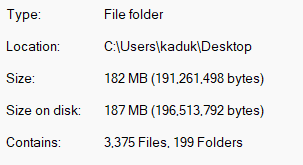

**Тема**
Темою роботи є "Побудова зображення тривимірних дискретно заданих поверхонь". Якщо спростити цю назву, то вийде побудова тривимірних зображень за заданою функцією. Дисксретно задана поверхня означає, що поверхня задача дискретними значенням, тобто окремими точками.

**Технології**
За основу я взяв Python, для графічного інтерфейсу використав PyQT5, також додатково для обчислення значень функцій використав бібліотеку numpy. Для візуалізації було використано matplolib pyplot

**Робота програми**
Програма запускається з консолі, після чого відкривається вікно з програмою

Для зручності додав функцію для автозаповнення полів

Ось так виглядає приклад виведення програми

Отриману фігуру можна крутити на 360 градусів

**Проблема**

Для курсової роботи я хотів створити .ехе файл, щоб будь-який корисувач зміг запустити мій проект, але тут я стикнувся з проблемами. Проблема в тому, що Python не заточений під те, щоб його перетворювали у виконуваний файл.
На той час я перебробував велику кількість бібліотек, які обіцяли що перетворять будь який проект в .exe.
Проблема була в тому, що на той момент як мінімум, ці всі бібліотеки працювали з простими проектами, і погано з проектами, які складаються з декількох файлів, та використовують різні бібліотеки, включаючи PyQT5.

Нарешті я найшов спосіб перетворити мій невеличкий проект в виконуваний файл, для цього я використав бібліотеку pyinstaller, з нею виявилось теж достатньо проблем. Витративши купу часу, я написав команду, яка змогла зробити те що мені було потрібно, ось вона: 
*pyinstaller main.py --exclude-module PyQt5 --exclude-module PySide2 --runtime-hook window.py --noconsole -i "world.ico"*
Проблема була майже вирішена, для цього мені довелося в папку з проектом закинути папки з бібліотеками, які використовуються в проекті.

В результаті папка з файлом почала виглядати ось так:

А розмір проекту збільшився до 182 МБ

В кінці кінців, мені вдалося завернути проект в .exe файл, але, як бачите, зі своїми нюансами. Я не бачу резону використовувати це для реальних проектів, лише в якості навчання. 
